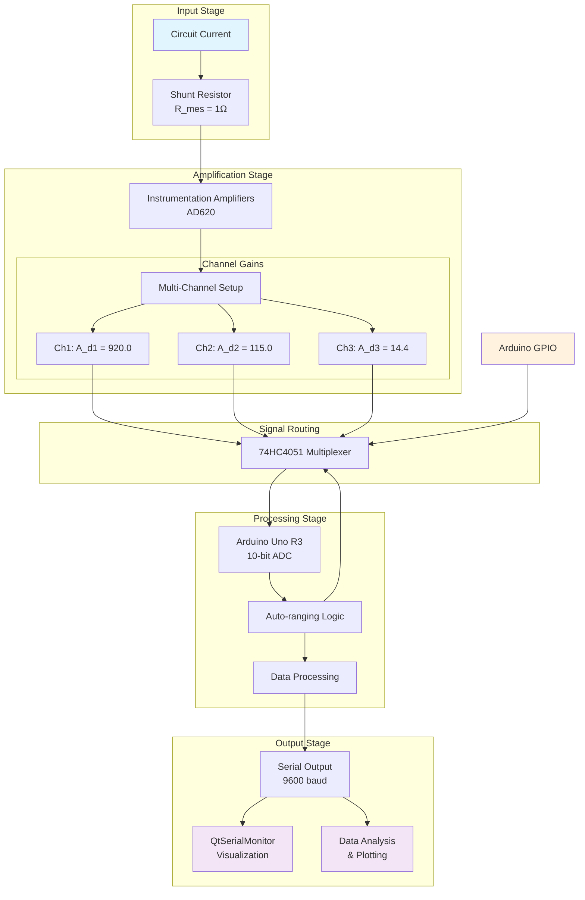

# Arduino As An Oscilloscope & Multi-Meter

##  Project Overview

Transform your **Arduino Uno R3** into a measurement instrument capable of measuring voltage, current, frequency, and resistance, with real-time visualization on your PC. This project explores enhancing the Arduino's basic ADC capabilities through multi-channel amplification and systematic design.

### Current Capabilities:
- **Voltage Measurement**: 0-5V range with 4.88mV resolution
- **Current Measurement**: Multi-range system using instrumentation amplifiers
- **Auto-ranging**: Channel selection for different current ranges
- **Real-time Serial Output**: Structured data for PC visualization
- **Design Framework**: Systematic approach to parameter selection

### Target Capabilities (In Development):
- Frequency measurement
- Resistance calculation
- Advanced waveform analysis

##  Integration with QtSerialMonitor

This project works with **[QtSerialMonitor](https://github.com/mich-w/QtSerialMonitor)** for data visualization:

```cpp
// Example output format
 Serial  <<  Voltage = 1.5576        Current[A] = 0.1573
 Serial  <<  Voltage = 1.2646        Current[A] = 0.1265
 Serial  <<  Voltage = 0.9521        Current[A] = 0.0953
 Serial  <<  Voltage = 0.6641        Current[A] = 0.0665
```

**Features enabled by QtSerialMonitor:**
- Real-time plotting of voltage and current waveforms
- Data logging and export capabilities
- Serial communication monitoring


##  Quick Start Guide

### Getting Started in 3 Simple Steps:

1. **Compile the Arduino Code**
   - Open the [arduino_as_an_oscilloscope](arduino_as_an_oscilloscope.ino) file in Arduino IDE
   - Select Arduino Uno as the board
   - Click `Export Compiled Binary` to compile and generate the HEX file

2. **Setup Proteus Simulation**
   - Open Proteus version 9 or later
   - Load the provided circuit design
   - Double-click the Arduino and browse to the generated HEX file
   - Click "Run Simulation"

3. **View Measurements**
   - The system will output data via serial communication
   - Use QtSerialMonitor or any serial terminal to view results
   - Watch real-time voltage and current measurements!


    **NB:** You must install and configure the virtual serial drivers to enable data transfer from Proteus to QtSerialMonitor or any other serial monitor.
    [Here is a quick guide on how to set it up.](https://www.youtube.com/watch?v=xJXAlE1q8RA)


---

##  Parameter Selection

This project uses a structured method for selecting components and gains based on fundamental circuit relationships and practical constraints.

The algorithm described below has been automated in python and the script can be found in the [Util-Scripts](Util-Scripts) folder. Its documentation is in the docs folder and it explains in details how to utilize the [tool](docs/parameter_optimizer.md).

### **Parameter Definitions:**

- **`V_os`**: Operational amplifier input offset voltage (50μV for AD620)
- **`P_in1`**: Target input precision for Channel 1 (typically 0.2 for 20% error budget)
- **`R_mes`**: Shunt resistance value (1.0Ω in current design)
- **`ΔI_c1`**: Base current range for Channel 1 (2.25mA in current design)
- **`K_p`**: ADC voltage resolution = `V_ref / 2^N` (0.0048828 V/step for 5V, 10-bit)
- **`V_on_min`**: Minimum output voltage  for the nth channel. Currentlys is a constnant across all channels set to 0.23V .

- **`k`**: Channel overlap factor (0.8 for 20% overlap)
- **`r`**: Geometric range ratio between channels (8.0 in current design)
- **`N`**: Number of measurement channels

### **Design Algorithm Steps:**

#### **Step 1: Determine Minimum Measurable Current**

The model uses the amplifier's offset voltage divided by the input precision constraint to determine the minimum usable voltage across the shunt resistor:

```math
I_{c_{\min_1}} = \frac{V_{os}}{P_{in_1} \cdot R_{mes}}
```

This ensures that the offset voltage contributes no more than fraction `P_in1` to the measurement error at the minimum current.

#### **Step 2: Calculate System Output Precision**

The output precision is determined by ADC resolution and minimum output voltage:

```math
P = \frac{K_p}{V_{on_{\min}}}
```


#### **Step 3: Channel 1 Design**

**Current range:**
```math
I_{c_{\max_1}} = I_{c_{\min_1}} + \Delta I_{c1}
```

**Required gain-shunt product:**
```math
A_{d1} \cdot R_{mes} = \frac{V_{on_{\min}}}{I_{c_{\min_1}}}
```

**Current sensitivity:**
```math
K_{c1} = \frac{K_p}{A_{d1} R_{mes}} = P \cdot I_{c_{\min_1}}
```

**Output voltage range:**
```math
V_{on_{\max_1}} = V_{on_{\min}} \cdot \frac{I_{c_{\max_1}}}{I_{c_{\min_1}}}
```

#### **Step 4: Subsequent Channel Design (n = 2 to N)**

**Channel overlap:**
```math
I_{c_{\min_n}} = k \cdot I_{c_{\max_{n-1}}}
```

**Geometric range scaling:**
```math
\Delta I_{cn} = \Delta I_{c1} \cdot r^{\,n-1}
```

**Channel maximum current:**
```math
I_{c_{\max_n}} = I_{c_{\min_n}} + \Delta I_{cn}
```

**Channel gain requirement:**
```math
A_{dn} \cdot R_{mes} = \frac{V_{on_{\min}}}{I_{c_{\min_n}}}
```

**Channel sensitivity:**
```math
K_{cn} = \frac{K_p}{A_{dn} R_{mes}} = P \cdot I_{c_{\min_n}}
```

#### **Step 5: Gain Progression Analysis**

**Gain ratio between consecutive channels:**
```math
\frac{A_{dn}}{A_{d(n+1)}} = \frac{A_{dn}R_{mes}}{A_{d(n+1)}R_{mes}} = \frac{V_{on_{\min}} / I_{c_{\min_n}}}{V_{on_{\min}} / I_{c_{\min_{n+1}}}} = \frac{I_{c_{\min_{n+1}}}}{I_{c_{\min_n}}}
```


### 3. **Current Performance**

**Implemented Ranges:**
- Current measurement via amplified shunt voltage
- Auto-ranging between different gain stages
- Voltage measurement using Arduino ADC

**Note on Accuracy**: The system shows good correlation between theoretical predictions and practical measurements, though ongoing calibration and validation are needed.

##  Technical Implementation

### Hardware Architecture:



### Software Features:
- Auto-ranging algorithm
- Structured data output
- Real-time performance monitoring

##  Current Status

**Working Features:**
- Multi-range current measurement
- Voltage measurement (0-5V)
- Auto-ranging between amplification stages
- Real-time serial data output
- QtSerialMonitor integration

**Areas for Improvement:**
- Accuracy calculations need verification
- Some gain stages require fine-tuning
- Mathematical model being validated against real measurements


**Important Note:** The design equations reflect the current state of understanding and may be updated as modeling inconsistencies are identified. The mathematical framework used to derive these equations is available in the documentation folder under the file:
**[ARDUINO_BASED_OSC](docs/ARDUINO_BASED_OSC.pdf)**.


