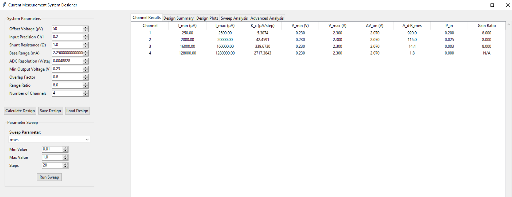
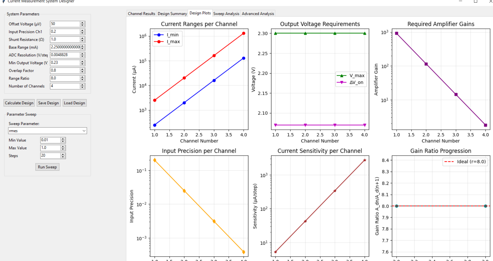

# Current Measurement System Designer - UI Tool

## Overview

The **Current Measurement System Designer** is a Python-based graphical user interface that automates the design and optimization of multi-channel current measurement systems using Arduino. This tool implements the mathematical framework described in our theoretical analysis and provides an intuitive way to explore design trade-offs.

## Features

### 🎛️ **Interactive Parameter Control**
- Real-time adjustment of all system parameters:
  - Offset voltage (`V_os`)
  - Input precision (`P_in1`) 
  - Shunt resistance (`R_mes`)
  - Base current range (`ΔI_c1`)
  - ADC resolution (`K_p`)
  - Output voltage constraints
  - Geometric scaling ratio (`r`)
  - Channel overlap factor (`k`)
  - Number of channels

### 📊 **Automated Design Calculations**
The UI automatically computes:
- Channel current ranges (min/max)
- Required amplifier gains
- Current sensitivity (`K_c`) for each channel
- Output voltage requirements
- Input precision constraints
- Gain progression ratios

### 📈 **Visual Analysis**
- **Design Plots**: 6 comprehensive plots showing:
  - Current ranges (log scale)
  - Voltage requirements
  - Amplifier gains
  - Input precision progression
  - Current sensitivity
  - Gain ratio analysis

- **Parameter Sweeps**: Analyze how system performance changes with:
  - Shunt resistance variations
  - Overlap factor optimization
  - Range ratio selection
  - Input precision trade-offs
  - Offset voltage impact
  - Channel count optimization

### 💾 **Data Management**
- Save/load design configurations
- Export plots as PNG or PDF
- Automatic timestamped backups
- JSON-based data storage

## How to Use

### 1. **Basic Design Calculation**

1. **Set Base Parameters**:
   - Start with default values or enter your specific requirements
   - Key parameters: `V_os` (50μV for AD620), `R_mes` (0.1-1Ω), `ΔI_c1` (2.5mA)

2. **Click "Calculate Design"**:
   - The system automatically computes all channel parameters
   - Results appear in the "Channel Results" table

3. **Review Summary**:
   - Check the "Design Summary" tab for key performance metrics
   - Verify dynamic range, accuracy, and gain requirements

### 2. **Parameter Sweep Analysis**

1. **Select Sweep Parameter**:
   - Choose from: `rmes`, `k`, `r`, `pin1`, `vos`, `n_channels`

2. **Set Sweep Range**:
   - Define minimum, maximum values and number of steps
   - Use logarithmic spacing for ratio parameters (`k`, `r`, `pin1`)

3. **Run Sweep**:
   - Click "Run Sweep" to analyze parameter sensitivity
   - Results appear in "Sweep Analysis" tab

### 3. **Interpret Results**

**Key Metrics to Monitor**:
- **Dynamic Range**: Ratio between maximum and minimum measurable current
- **Gain Realizability**: Ensure required gains are achievable (1-1000 for AD620)
- **Voltage Compliance**: Output voltages should stay within 0-5V range
- **Gain Progression**: Smooth transitions between channels

## Example Workflow

### Designing a 3-Channel System:

1. **Set Requirements**:
   ```
   V_os = 50 μV (AD620)
   R_mes = 1 Ω
   ΔI_c1 = 2.25 mA
   Target Range: 250 μA to 160 mA
   ```

2. **Adjust Parameters**:
   - Set `n_channels = 3`
   - Set `r = 8.0` (geometric scaling)
   - Set `k = 0.8` (20% overlap)

3. **Analyze Results**:
   - Check that Channel 1 covers 250μA-2.5mA
   - Verify gains are practical (920, 115, 14.4)
   - Ensure output voltages stay within 0.23V-2.3V
4. **Expected Results**
    - 
    - 

    - A constant output voltage swing minimizes variations at the Arduino ADC input, which simplifies the firmware logic.
    
## Mathematical Foundation

The UI implements the complete mathematical framework:

**Core Equations**:
```python
# Minimum current from offset constraint
I_min1 = V_os / (P_in1 * R_mes)

# Current sensitivity
K_c = K_p / (A_d * R_mes)

# Geometric channel scaling
ΔI_cn = ΔI_c1 * r^(n-1)

# Channel overlap
I_min_n = k * I_max_(n-1)
```

## File Structure

```
Util-Scripts/
├── parameters_optimizer_ui.py    # Main UI application
├── current_design_v2.py          # Core calculation engine
├── ui_utils.py                   # Plotting and utility functions
└── current_design_data/          # Auto-created data directory
    └── design_YYYYMMDD_HHMMSS.json
```

## Requirements

```bash
pip install matplotlib numpy
```

## Usage Tips

1. **Start with Defaults**: Use the provided default values as a starting point
2. **Sweep Before Finalizing**: Run parameter sweeps to understand sensitivity
3. **Check Practical Limits**: Verify gains and voltages are physically realizable
4. **Save Iterations**: Save different design versions for comparison
5. **Use Log Scales**: Many relationships are logarithmic - use appropriate plotting

## Output Files

- **Design Files**: JSON format with complete parameter sets
- **Plot Exports**: High-resolution PNG/PDF for documentation
- **Sweep Data**: Comprehensive parameter sensitivity analysis
